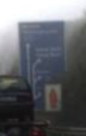
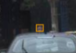
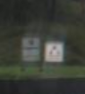
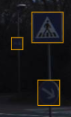
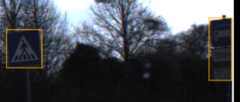

# Guideline gán nhãn vị trí biển báo giao thông cố định

**Version:** v2

## 1. Mục tiêu và phạm vi

Phát hiện vị trí của từng biển báo giao thông cố định nhìn thấy trong ảnh đường. Module perception phía sau dùng vị trí này để tập trung xử lý. Người gán nhãn không phân loại họ biển hoặc ý nghĩa pháp lý của từng biển.

Gán nhãn biển cấm, biển hiệu lệnh, biển cảnh báo và biển chỉ dẫn đặt cố định bên đường. Biển không cần quay mặt về phía xe mới được gán nhãn. Bỏ qua đèn giao thông, vạch kẻ đường, biển quảng cáo, bảng chỉ có tên đường, biển gắn trên xe hoặc rơ-moóc, mặt sau trơn của biển và ảnh phản chiếu.

Ảnh GTSDB có biển của Đức. Không bỏ qua biển chỉ dẫn vì chữ lạ hoặc không đọc được. Hãy dựa vào hình dạng và ngữ cảnh để xác định đó có phải biển giao thông không. Nếu bằng chứng chưa đủ, làm theo mục 7.

## 2. Đơn vị gán nhãn

Đây là task ảnh tĩnh. Mỗi mặt biển riêng biệt là một instance và có một rectangle. Hai biển độc lập gắn trên cùng cột cần hai rectangle. Không vẽ cột, giá đỡ hoặc nền xung quanh.

Nếu biển phụ gắn ngay dưới biển chính và bổ sung thông tin cho biển đó, gộp biển chính cùng biển phụ trong một rectangle. Nếu đó là một biển độc lập đặt cạnh biển khác, vẽ rectangle riêng. Chỉ gán nhãn mặt trước có thông tin.

## 3. Quy tắc hình học

Dùng rectangle ôm phần mặt biển nhìn thấy. Không đoán phần bị che. Không vẽ cột, giá đỡ hoặc nền. Nếu mép ảnh cắt mất một phần biển, chỉ vẽ phần nhìn thấy và đặt `truncated=true`.

Dùng thuộc tính `occluded` có sẵn của CVAT để ghi nhận vật khác che một phần biển. Không tạo thêm attribute `occluded`. Vẫn gán nhãn biển bị che nếu phần còn thấy đủ để nhận ra đó là biển.

Cạnh dài nhất của mặt biển phải từ 8 px trở lên. Bỏ qua biển nhỏ hơn 8 px. Với biển từ 8 px trở lên, gán nhãn nếu vẫn nhận ra đó là biển. Mỗi cạnh của box được lệch tối đa 2 px so với mép ngoài nhìn thấy.

## 4. Taxonomy

Dùng một class `traffic_sign` cho mọi biển thuộc phạm vi. Không tạo class riêng theo họ biển hoặc nội dung biển.

| Trường | Cấp | Giá trị | Mặc định | Quy tắc |
|---|---|---|---|---|
| `visibility` | Attribute của object | `visible`, `blurry` | `visible` | Chọn `blurry` khi vẫn nhận ra biển nhưng mặt biển bị mờ. |
| `truncated` | Attribute của object | `false`, `true` | `false` | Chọn `true` khi mép ảnh cắt mất một phần biển. |
| `facing` | Attribute của object | `relevant`, `irrelevant` | `relevant` | Ghi biển có phục vụ hướng đi nhìn thấy của xe hay không. |
| `needs_review` | Attribute của object | `false`, `true` | `false` | Chọn `true` khi biển đã xác nhận nhưng còn attribute chưa chốt hoặc cần owner xem lại. |
| `weather` | Attribute của image tag | `sunny`, `cloudy`, `rainy`, `snowy`, `other` | `sunny` | Ghi điều kiện thời tiết nhìn thấy trong ảnh. |
| `brightness` | Attribute của image tag | `day`, `night` | `day` | Ghi điều kiện sáng của ảnh. |
| `decision` | Attribute của `review_candidate` | `IGNORE`, `UNKNOWN`, `ESCALATE` | `__undefined__` | Ghi quyết định cho object cần rà soát nhưng chưa xác nhận là `traffic_sign`. |
| `reason` | Attribute của `review_candidate` | `out_of_scope`, `too_small`, `not_sure_sign`, `image_quality`, `ego_route_unclear`, `other` | `__undefined__` | Ghi lý do cần rà soát hoặc bỏ qua. |

CVAT gán mặc định `visible`, `false`, `relevant`, `sunny` và `day`. Kiểm tra các mặc định và đổi giá trị khi ảnh cho thấy điều khác. Mỗi ảnh có đúng một tag `image_status` với thông tin thời tiết và điều kiện sáng. Tag này cũng cho biết ảnh đã được rà soát. Nếu không có biển thuộc phạm vi thì không có rectangle `traffic_sign`. Thuộc tính che khuất dùng cờ có sẵn trong CVAT, không khai báo lại trong JSON. Chỉ dùng label `review_candidate` cho case cần chấm hoặc chưa giải quyết. Không đưa label này vào dữ liệu huấn luyện detector.

## 5. Trường hợp cần và không cần gán nhãn

**LABEL:** Vẽ một rectangle `traffic_sign` cho mỗi biển cố định nhìn thấy và thuộc phạm vi. Vẫn gán nhãn biển bị mờ nếu nhận ra đó là biển. Không yêu cầu đọc được chữ.

**IGNORE:** Không tạo `traffic_sign` cho object ngoài phạm vi, mặt sau trơn, ảnh phản chiếu hoặc biển có cạnh dài dưới 8 px. Với object trong blind set cần chấm quyết định bỏ qua, thêm rectangle `review_candidate`, đặt `decision=IGNORE` và chọn lý do phù hợp. Không cần tạo review rectangle cho mọi object ngoài phạm vi trong ảnh thường.

Nếu ảnh không có biển thuộc phạm vi, không vẽ `traffic_sign` nhưng vẫn tạo tag `image_status`. Tag cho biết ảnh đã được rà soát; sự vắng mặt của rectangle `traffic_sign` là quyết định âm. Chỉ tạo tag này sau khi quét hết ảnh.

## 6. Độ rõ và che khuất

Đặt `visibility=blurry` nếu ảnh mờ nhưng vẫn nhận ra object là biển giao thông. Không suy luận đó là biển chỉ từ màu sắc. Nếu vật khác che một phần biển, vẽ phần còn nhìn thấy và bật cờ `occluded` có sẵn trong CVAT. Nếu mép ảnh cắt biển, đặt `truncated=true`.

Áp dụng ngưỡng 8 px cho phần mặt biển nhìn thấy. Phóng to ảnh trước khi quyết định. Bỏ qua biển có cạnh dài dưới 8 px, kể cả khi màu sắc hoặc vị trí khiến nó trông giống biển.

## 7. Mơ hồ và escalation

| Tình huống | Quyết định | Thể hiện trong CVAT |
|---|---|---|
| Nhận ra chắc chắn là biển | `LABEL` | Rectangle `traffic_sign` với đủ attribute. |
| Biết object ngoài phạm vi hoặc nhỏ hơn ngưỡng | `IGNORE` | Không tạo `traffic_sign`. Với blind candidate cần chấm, thêm `review_candidate`, đặt `decision=IGNORE` và chọn `reason`. |
| Object có thể là biển nhưng bằng chứng chưa đủ | `UNKNOWN` | Vẽ rectangle `review_candidate`, đặt `decision=UNKNOWN` và `reason=not_sure_sign`. |
| Không thể giải quyết biển hoặc attribute bằng guideline | `ESCALATE` | Đánh dấu object bằng `review_candidate` và `decision=ESCALATE`. Với vấn đề ảnh nói chung, thêm tag `image_escalate`. Ghi sample ID, vị trí, bằng chứng và câu hỏi vào log dự án. |
| Đã xác nhận là biển nhưng chưa rõ biển phục vụ tuyến nào | `ESCALATE` để review | Giữ rectangle `traffic_sign`, để `facing=relevant` theo giá trị mặc định và đặt `needs_review=true`. Owner cần rà soát rồi xác nhận hoặc đổi attribute. Ghi vị trí và câu hỏi. |
| Ảnh quá tối, mờ hoặc hỏng để đánh giá | `ESCALATE` | Không tạo rectangle `traffic_sign` theo suy đoán. Thêm tag `image_escalate` và ghi sample ID cùng lý do vào log. |

Không dùng `IGNORE` để thay cho "không biết". Dùng `UNKNOWN` hoặc `ESCALATE` khi thiếu bằng chứng. Owner phân xử case escalation dựa trên ảnh. Nếu ảnh vẫn không đủ căn cứ, giữ case ở trạng thái escalation và ghi câu hỏi chưa giải quyết.

## 8. Quy tắc thời gian

Không áp dụng. Mỗi sample là một ảnh tĩnh, không phải video track.

## 9. Ví dụ

Chỉ dùng sample ID trong split `example` hoặc `calibration` của `sample_pack.csv`. Bốn ID dưới đây đang được xếp vào split `example` trong sample pack hiện tại.

| sample_id | Quan sát | Expected output | Rule áp dụng |
|---|---|---|---|
| `GTS01` | Một biển tròn viền đỏ rõ nét. | Một rectangle ôm mặt biển, không bao gồm cột. | Geometry. |
| `GTS04` | Hai biển riêng gắn trên cùng một cột. | Hai rectangle riêng, mỗi rectangle ôm một mặt biển. | Nhiều instance trên một giá đỡ. |
| `GTS07` | Biển ở rất xa và nhỏ hơn ngưỡng 8 px; không có biển nào khác trong phạm vi. | Không có rectangle `traffic_sign`; chỉ tạo tag `image_status`. | Negative image và ngưỡng kích thước. |
| `GTS12` | Vật nghi là biển nhưng mờ/lóa, chưa rõ có phải biển hay không. | Không vẽ box đoán; ghi sample ID, vị trí và lý do để reviewer phân xử. | Bất định về một object. |

## 10. Lỗi thường gặp

- Vẽ cả cột, giá đỡ hoặc nền quanh biển.
- Gộp nhiều biển độc lập trên cùng cột thành một rectangle.
- Tách biển chính khỏi phần thông tin phụ gắn trực tiếp với biển.
- Bỏ qua biển chỉ dẫn vì chữ tiếng Đức lạ hoặc khó đọc.
- Đoán hướng phục vụ khi không đủ căn cứ; giữ `facing=relevant` mặc định và yêu cầu review.
- Gán `traffic_sign` cho object chưa xác định được có phải biển hay không.
- Dùng `IGNORE` khi bằng chứng chưa đủ.
- Quên tạo tag `image_status` cho ảnh không có biển trong phạm vi.
- Vẽ box cho biển nhỏ hơn 8 px.
- Tạo attribute `occluded` riêng dù CVAT đã có cờ che khuất.

## 11. Ảnh tình huống trong guideline nguồn

Các ảnh dưới đây được đưa từ mục escalation của tài liệu Word v2. Giữ nguyên quyết định và ghi chú của nguồn; nhóm cần đối chiếu các trường hợp này với catalog và chốt các điểm chưa nhất quán trước khi freeze.

| Sample trong nguồn | Quyết định/ghi chú trong nguồn | Ảnh |
|---|---|---|
| `GTS04` | `IGNORE`: nguồn mô tả đây là bảng chỉ tên đường, ngoài scope. |  |
| `GTS07` | `LABEL`: nguồn ghi biển nhỏ nhưng vẫn xác định được và kích thước box đủ lớn. |  |
| Không ghi sample ID | `IGNORE`: nguồn ghi hai biển trắng nhỏ cạnh nhau, không đủ thông tin quyết định. |  |
| `GTS092` | `ESCALATE`: nguồn hỏi biển thuộc nhánh đường nào. ID này hiện không có trong `data/catalog.csv`; cần xác minh trước khi dùng làm sample của dự án. |   |
